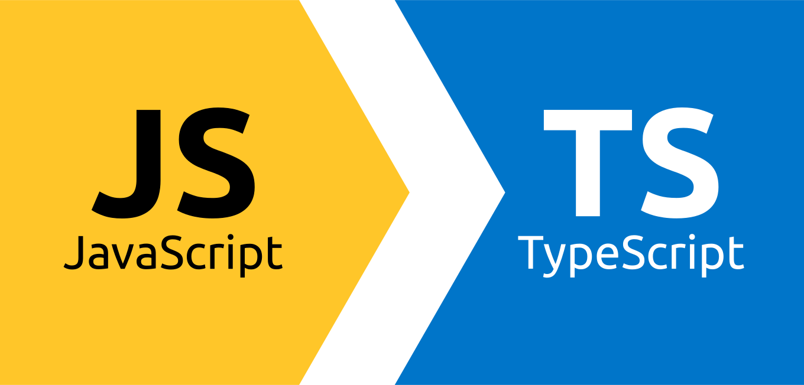

# TypeScript Course



## 📌 DESCRIPTION

This repository was created to learn and test the **TypeScript** language.

## 📌 DEVELOPMENT

This project uses the [npm scripts](https://docs.npmjs.com/cli/scripts) to run the development environment.

### Install the dependencies

```bash
npm install
```

### Compile TypeScript files to JavaScript files

```bash
tsc './path/nameFile.ts'
```

## 📌 RESOURCES

- YouTube: [TypeScript Course for Beginners 2021 - Learn TypeScript from Scratch!](https://www.youtube.com/watch?v=BwuLxPH8IDs)
- pro.academind: [Understanding TypeScript](https://pro.academind.com/p/understanding-typescript)